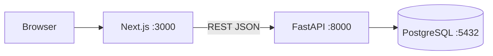
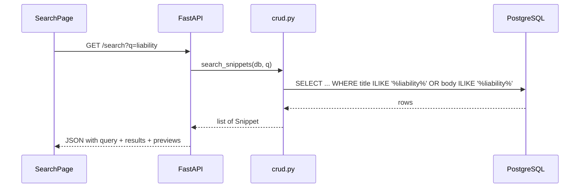

# ARCHITECTURE — Snippet Search

**Last updated:** 2026-06-24  
**Requirements:** [`PRD.md`](PRD.md)  
**Roadmap:** [`PLAN.md`](PLAN.md)

---

## 1. System overview

A monorepo with a **FastAPI** backend, **PostgreSQL** database, and **Next.js** frontend. The frontend calls the backend REST API directly from the browser (CORS enabled). No authentication layer.



### Reference architecture

Backend structure is inspired by the official **[full-stack-fastapi-template](https://github.com/fastapi/full-stack-fastapi-template)**:

| Template pattern | Our adaptation |
|------------------|----------------|
| `backend/app/api/routes/` | `backend/app/routers/` — snippets + search |
| `backend/app/models.py` | SQLAlchemy `Snippet` model |
| `backend/app/schemas.py` | Pydantic request/response models |
| `backend/app/crud.py` | Database operations |
| `backend/app/core/config.py` | Application settings (pydantic-settings) |
| `backend/app/api/deps.py` | `get_db` dependency |
| React frontend | **Next.js App Router** (per challenge requirement) |
| Auth, users, Alembic | **Omitted** — out of scope for v1 |

---

## 2. Repository layout

```
snippet-search/
├── INTERN_GUIDELINE.md      # challenge spec (provided)
├── PLAN.md                  # learning → planning → execution roadmap
├── PRD.md                   # requirements & decisions
├── ARCHITECTURE.md          # this file
├── README.md                # setup instructions (Phase 3)
├── NOTES.md                 # submission notes (Phase 3)
├── docker-compose.yml       # PostgreSQL + backend API (project init)
├── backend/
│   ├── Dockerfile           # FastAPI image
│   ├── app/
│   │   ├── __init__.py
│   │   ├── main.py              # FastAPI app, CORS, router registration
│   │   ├── core/
│   │   │   ├── __init__.py
│   │   │   └── config.py        # pydantic-settings application config
│   │   ├── database.py          # engine, SessionLocal, get_db, create_tables
│   │   ├── models.py            # SQLAlchemy Snippet
│   │   ├── schemas.py           # Pydantic SnippetCreate, SnippetUpdate, responses
│   │   ├── crud.py              # get, list, create, update, delete, search
│   │   └── routers/
│   │       ├── __init__.py
│   │       ├── snippets.py      # /snippets CRUD
│   │       ├── search.py        # /search
│   │       └── health.py        # /health
│   ├── seed.py                  # load 25 snippets from seed_data.json
│   ├── seed_data.json           # copied from INTERN_GUIDELINE.md
│   └── requirements.txt
└── frontend/
    ├── app/
    │   ├── layout.tsx             # root layout, header nav
    │   ├── page.tsx               # search page (/)
    │   ├── loading.tsx            # global loading fallback
    │   ├── snippets/
    │   │   ├── new/
    │   │   │   └── page.tsx       # create form
    │   │   └── [id]/
    │   │       ├── page.tsx       # detail view
    │   │       └── edit/
    │   │           └── page.tsx   # edit form
    │   └── globals.css
    ├── components/
    │   ├── Header.tsx
    │   ├── SearchBar.tsx
    │   ├── SnippetList.tsx
    │   ├── SnippetCard.tsx
    │   ├── SnippetForm.tsx
    │   ├── LoadingMessage.tsx
    │   └── ErrorMessage.tsx
    ├── lib/
    │   └── api.ts                 # typed fetch wrappers
    ├── package.json
    └── tsconfig.json
```

---

## 3. Database schema

### Table: `snippets`

```sql
CREATE TABLE snippets (
    id          SERIAL PRIMARY KEY,
    title       VARCHAR(200) NOT NULL,
    body        TEXT NOT NULL,
    tags        TEXT[] NOT NULL DEFAULT '{}',
    created_at  TIMESTAMPTZ NOT NULL DEFAULT NOW()
);

CREATE INDEX idx_snippets_created_at ON snippets (created_at DESC);
```

### SQLAlchemy model (conceptual)

```python
class Snippet(Base):
    __tablename__ = "snippets"

    id: Mapped[int] = mapped_column(primary_key=True)
    title: Mapped[str] = mapped_column(String(200))
    body: Mapped[str] = mapped_column(Text)
    tags: Mapped[list[str]] = mapped_column(ARRAY(String), default=list)
    created_at: Mapped[datetime] = mapped_column(DateTime(timezone=True), server_default=func.now())
```

**v1 migrations:** `Base.metadata.create_all(bind=engine)` on startup — sufficient for this challenge. Alembic can be added later (as in full-stack-fastapi-template).

---

## 4. API endpoints

| Method | Path | Handler | Success | Not found | Validation error |
|--------|------|---------|---------|-----------|------------------|
| `POST` | `/snippets` | `create_snippet` | `201` + body | — | `422` |
| `GET` | `/snippets` | `list_snippets` | `200` + paginated | — | `422` (bad params) |
| `GET` | `/snippets/{id}` | `get_snippet` | `200` + body | `404` | — |
| `PUT` | `/snippets/{id}` | `update_snippet` | `200` + body | `404` | `422` |
| `DELETE` | `/snippets/{id}` | `delete_snippet` | `204` | `404` | — |
| `GET` | `/search` | `search_snippets` | `200` + results | — | — |
| `GET` | `/health` | `health_check` | `200` | — | — |

### Request flow (example: search)



---

## 5. Search implementation

### v1 (required) — `ILIKE`

```python
pattern = f"%{q.strip()}%"
query = (
    select(Snippet)
    .where(or_(Snippet.title.ilike(pattern), Snippet.body.ilike(pattern)))
    .order_by(Snippet.created_at.desc())
)
```

**Preview helper:**

```python
def make_preview(body: str, max_len: int = 120) -> str:
    if len(body) <= max_len:
        return body
    return body[:max_len].rstrip() + "..."
```

### v2 (optional nice-to-have) — PostgreSQL full-text search

```sql
-- Add tsvector column + GIN index
ALTER TABLE snippets ADD COLUMN search_vector tsvector;
CREATE INDEX idx_snippets_fts ON snippets USING GIN (search_vector);
```

Only pursue after v1 works and tests pass.

---

## 6. Backend configuration

Settings are loaded via `pydantic-settings` in `backend/app/core/config.py`. Docker Compose supplies database and CORS configuration for the API container.

### Dependencies (`requirements.txt`)

```
fastapi
uvicorn[standard]
sqlalchemy
psycopg2-binary
pydantic-settings
python-dotenv
```

### `get_db` pattern (from full-stack-fastapi-template)

```python
def get_db():
    db = SessionLocal()
    try:
        yield db
    finally:
        db.close()
```

Each route receives `db: Session = Depends(get_db)`. Commits happen in CRUD functions or route handlers after successful operations.

### CORS

```python
app.add_middleware(
    CORSMiddleware,
    allow_origins=settings.cors_origins_list,
    allow_credentials=True,
    allow_methods=["*"],
    allow_headers=["*"],
)
```

---

## 7. Frontend architecture

### Routing (Next.js App Router)

| File | Route | Renders |
|------|-------|---------|
| `app/page.tsx` | `/` | Search page |
| `app/snippets/[id]/page.tsx` | `/snippets/1` | Detail |
| `app/snippets/new/page.tsx` | `/snippets/new` | Create |
| `app/snippets/[id]/edit/page.tsx` | `/snippets/1/edit` | Edit |

### Component strategy

| Component | `"use client"` | Reason |
|-----------|----------------|--------|
| `SearchBar`, `SnippetList` | yes | User input, debounced fetch |
| `SnippetForm` | yes | Controlled form state |
| `app/snippets/[id]/page.tsx` | yes | Simpler error/loading with hooks |
| `Header`, `layout.tsx` | no | Static shell |

### API client (`lib/api.ts`)

```typescript
const API_URL = "http://localhost:8000"; // overridable via local frontend config

export async function searchSnippets(q: string): Promise<SearchResponse> { ... }
export async function getSnippet(id: number): Promise<Snippet> { ... }
export async function createSnippet(data: SnippetCreate): Promise<Snippet> { ... }
export async function updateSnippet(id: number, data: SnippetCreate): Promise<Snippet> { ... }
export async function deleteSnippet(id: number): Promise<void> { ... }
```

All functions throw on non-OK responses so components can catch and show `ErrorMessage`.

---

## 8. Error handling

### Backend

| Situation | Response |
|-----------|----------|
| Snippet not found | `HTTPException(status_code=404, detail="Snippet not found")` |
| Validation failure | FastAPI automatic `422` with field errors |
| DB connection error | `500` — log error, generic message |

### Frontend

| Situation | UI |
|-----------|-----|
| Network / 5xx | `ErrorMessage` with retry |
| 404 on detail | "Snippet not found" + link home |
| 422 on form | Show field-level or summary error |
| Empty search results | "No snippets match your search" |

---

## 9. Seed data

`backend/seed_data.json` — 25 legal snippets from `INTERN_GUIDELINE.md`.

`seed.py` behavior:
1. Connect to database
2. Skip if snippets table already has rows (idempotent)
3. Insert all seed entries
4. Print count inserted

Run: `python -m seed` from `backend/` directory.

---

## 10. Local development

### Prerequisites

| Tool | Minimum | Recommended (June 2026) | Notes |
|------|---------|------------------------|-------|
| **Docker** | Docker Desktop 4.x+ | Latest stable | **Required** — PostgreSQL and backend run via Compose at project init |
| **Python** | 3.13+ | 3.13.x | Optional — only if running backend outside Docker |
| **Node.js** | 22 LTS+ | 24 LTS (Krypton) or 22 LTS (Jod) | Required for Next.js frontend (runs on host) |
| **PostgreSQL** | 17+ | 17.x | Provided by Docker — no local install needed when using Compose |

Install checks:

```bash
docker --version          # Docker 24+ or Docker Desktop
docker compose version
node --version            # v22.x or v24.x (frontend)
python --version          # Python 3.13.x (only if running backend outside Docker)
```

### Docker setup (primary — project initialization)

Docker Compose is created during **project initialization**, not as a later add-on. Pattern inspired by [full-stack-fastapi-template](https://github.com/fastapi/full-stack-fastapi-template) `docker-compose.yml`.

**Services:**

| Service | Image / build | Port | Purpose |
|---------|---------------|------|---------|
| `db` | `postgres:17` | `5432` | PostgreSQL database |
| `api` | `backend/Dockerfile` | `8000` | FastAPI app |

**Root `docker-compose.yml` (conceptual):**

```yaml
services:
  db:
    image: postgres:17
    environment:
      POSTGRES_USER: postgres
      POSTGRES_PASSWORD: postgres
      POSTGRES_DB: snippet_search
    ports:
      - "5432:5432"
    volumes:
      - postgres_data:/var/lib/postgresql/data

  api:
    build: ./backend
    ports:
      - "8000:8000"
    depends_on:
      - db

volumes:
  postgres_data:
```

**Init workflow:**

```bash
# 1. Start database + API
docker compose up -d

# 2. Seed (once API is healthy)
docker compose exec api python seed.py

# 3. Frontend (on host)
cd frontend
npm run env:setup
npm install
npm run dev
```

### Verify

- Swagger: http://localhost:8000/docs
- App: http://localhost:3000
- Health: http://localhost:8000/health

### Alternative: run backend without Docker

If you prefer a native Python environment, install PostgreSQL 17 locally:

```bash
createdb snippet_search
cd backend
pip install -r requirements.txt
uvicorn app.main:app --reload --port 8000
python seed.py
```

---

## 11. Future improvements

| Improvement | Effort | Notes |
|-------------|--------|-------|
| Alembic migrations | Low | Add when schema changes |
| Full-text search | Medium | Replace ILIKE with `tsvector` + ranking |
| Search highlight | Low | Wrap matched terms in `<mark>` on frontend |
| Pytest suite | Medium | Test CRUD + search + 404 cases |
| `updated_at` column | Low | Track last edit time |
| Frontend in Compose | Low | Add `frontend` service to `docker-compose.yml` |

These map directly to the "what you'd improve" section in `NOTES.md`.
