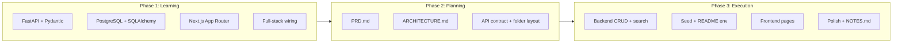

# Snippet Search: Learning → Planning → Execution

**Deadline:** Sunday, 28 June 2026, 16:00 CEST / 21:30 MMT  
**Time budget:** ~8–12 hours total  
**Current state:** Phase 2 complete — `PRD.md` and `ARCHITECTURE.md` written. Ready for Phase 3 execution.

---

## Recommended phase flow



---

## Tool versions (June 2026)

Use current LTS/stable releases — the old minimums (Python 3.11, Node 18, PostgreSQL 14) are outdated or near EOL.

| Tool | Use |
|------|-----|
| **Python 3.13+** | Backend / FastAPI |
| **Node.js 22 LTS+** (or **24 LTS**) | Next.js frontend |
| **PostgreSQL 17+** | Database |

Full setup details: [`ARCHITECTURE.md` §10](ARCHITECTURE.md#10-local-development)

---

## Git commit conventions

Follow **[Conventional Commits 1.0.0](https://www.conventionalcommits.org/en/v1.0.0/)**. Commit in small steps — the intern guideline reviews your git history.

### Types for this project

| Type | When to use | Example |
|------|-------------|---------|
| `feat` | New user-facing capability | `feat(api): add snippet search endpoint` |
| `fix` | Bug fix | `fix(frontend): show error state when API is down` |
| `docs` | README, PLAN, PRD, NOTES only | `docs: add local setup instructions` |
| `test` | Add or update tests | `test(api): cover snippet 404 responses` |

---

## Phase 1: Learning (2–3 hours)

Goal: understand *enough* to explain every line you submit. Focus on concepts directly used by this challenge.

### Backend — FastAPI + PostgreSQL

| Topic | Why it matters for this project | Resource |
|-------|----------------------------------|----------|
| Routes, status codes, Pydantic models | All 7 API endpoints + validation | [FastAPI Tutorial](https://fastapi.tiangolo.com/tutorial/) (first 6 sections) |
| SQL databases with FastAPI | Snippet persistence | [FastAPI SQL Databases](https://fastapi.tiangolo.com/tutorial/sql-databases/) |
| CRUD + project structure | Clean, reviewable code | [Pasly CRUD tutorial](https://pasly.co/blogs/fastapi-sqlalchemy-postgresql-crud) (simpler) or [StackLesson CRUD layers](https://www.stacklesson.com/react-fastapi/fastapi-crud/ch26-lesson-01-crud-architecture/) |
| Pagination | `GET /snippets?page=&limit=` | SQLAlchemy `offset` / `limit` + `count` query |
| Keyword search | `GET /search?q=` | Start with `ILIKE '%q%'` on title + body; optional upgrade: [PostgreSQL full-text search](https://www.postgresql.org/docs/current/textsearch-tables.html) |
| CORS | Next.js (port 3000) calling FastAPI (port 8000) | [FastAPI CORS middleware](https://fastapi.tiangolo.com/tutorial/cors/) |

**Key concepts checklist:**
- Pydantic `BaseModel` for request/response shapes
- `status_code=201` on create, `HTTPException(404)` when id missing
- Dependency injection: `db: Session = Depends(get_db)`
- Tags stored as PostgreSQL `TEXT[]` (see `PRD.md`)

### Frontend — Next.js

| Topic | Why it matters | Resource |
|-------|----------------|----------|
| App Router file structure | `app/` pages for search, detail, form | [Next.js App Router](https://nextjs.org/docs/app) |
| Data fetching + loading states | Required: never blank screen | [Fetching Data](https://nextjs.org/docs/app/getting-started/fetching-data) |
| Client vs Server Components | Search box = client; list can be either | [Server and Client Components](https://nextjs.org/docs/app/getting-started/server-and-client-components) |
| `loading.tsx` + error UI | Built-in loading boundaries | [loading.js convention](https://nextjs.org/docs/app/api-reference/file-conventions/loading) |
| Forms + navigation | Create/edit snippet | [Forms](https://nextjs.org/docs/app/guides/forms) |

**Recommended frontend approach (keep it simple):**
- Use **Client Components** for search input (debounced search) and forms (controlled inputs)
- Use `fetch(`${API_URL}/search?q=...`)` with explicit `loading` / `error` state
- Plain `fetch` + `useState` is enough — no SWR/React Query required

### Full-stack wiring (30 min)

- Run FastAPI on `http://localhost:8000`, Next.js on `http://localhost:3000`
- Set `NEXT_PUBLIC_API_URL=http://localhost:8000` in frontend `.env.local`
- Enable CORS on FastAPI for `http://localhost:3000`
- Test with Swagger UI at `http://localhost:8000/docs` before building UI

### Primary reference project (save & study)

**[full-stack-fastapi-template](https://github.com/fastapi/full-stack-fastapi-template)** — the official FastAPI full-stack starter. Highly recommended as your main architectural reference.

| What to borrow | What to adapt |
|----------------|---------------|
| Backend folder layout (`app/api`, `app/models`, `app/schemas`, `app/crud`) | Frontend is **Next.js** per challenge (template uses React) |
| `get_db` dependency injection pattern | Simpler — no auth, no users |
| Pydantic schemas separate from SQLAlchemy models | Single `snippets` resource instead of items/users |
| `.env` + settings pattern | No Docker required for v1 (optional nice-to-have) |
| Seed / initial data approach | Use the 25 legal snippets from `INTERN_GUIDELINE.md` |

Clone locally for reference:

```bash
git clone https://github.com/fastapi/full-stack-fastapi-template.git
```

Skim `backend/app/` structure before scaffolding your own backend. Do **not** copy the whole repo — this challenge is intentionally smaller.

---

## Phase 2: Planning — DONE

| Document | Status | Purpose |
|----------|--------|---------|
| [`PRD.md`](PRD.md) | Complete | Requirements, decisions, acceptance criteria |
| [`ARCHITECTURE.md`](ARCHITECTURE.md) | Complete | System design, schema, API table, folder layout |

### Planning exit criteria

You are ready to execute when you can answer without looking:
- What does each endpoint return and which status codes?
- What are the 4 frontend routes?
- How are tags stored in PostgreSQL?
- How does the frontend know the API base URL?

---

## Phase 3: Execution (5–7 hours) — NEXT

Execute in **small Conventional Commits** — one logical step per commit (see [Git commit conventions](#git-commit-conventions) above). The guideline explicitly reviews commit history.

### Milestone A — Backend foundation (~2h)

| Step | Suggested commit |
|------|------------------|
| 1. Init repo + `.gitignore` | `feat: add gitignore for python and node` |
| 2. Backend scaffold — FastAPI, PostgreSQL, `Snippet` model | `feat(backend): scaffold fastapi app and postgres connection` |
| 3. CRUD endpoints | `feat(api): add snippet CRUD routes` |
| 4. Pagination | `feat(api): add paginated snippet list` |
| 5. Search | `feat(api): add keyword search endpoint` |
| 6. Health | `feat(api): add health check endpoint` |
| 7. Seed script | `feat(db): add seed script with sample snippets` |
| 8. Manual test | _(no commit — verify in Swagger)_ |

### Milestone B — Frontend (~2.5h)

| Step | Suggested commit |
|------|------------------|
| 9. Next.js scaffold | `feat(frontend): scaffold next.js app router` |
| 10. Search page | `feat(frontend): add search page with loading states` |
| 11. Detail page | `feat(frontend): add snippet detail view` |
| 12. Create form | `feat(frontend): add snippet create form` |
| 13. Edit form | `feat(frontend): add snippet edit form` |
| 14. CORS + E2E smoke test | `fix(api): configure cors for local frontend` _(if needed)_ |

### Milestone C — Submission polish (~1h)

| Step | Suggested commit |
|------|------------------|
| 15. `README.md` | `docs: add setup and env instructions` |
| 16. `NOTES.md` | `docs: add project notes and decisions` |
| 17. Lint/format pass | `fix: apply lint and format fixes` |
| 18. Docker Compose | `feat: add docker-compose for development` |
| 19. Full-text search | `feat(api): add postgres full-text search` |
| 20. Search highlighting | `feat(frontend): highlight search matches in results` |
| 21. Pytest tests | `test(api): add backend test coverage` |

### Time-boxing priority (drop from bottom up)

1. All required API endpoints with correct status codes
2. Search page with loading/error states
3. Detail view
4. Create form
5. Edit form
6. Seed script, Docker, FTS, tests

---

## Learning resources (bookmark list)

### Backend
- [FastAPI Tutorial](https://fastapi.tiangolo.com/tutorial/)
- [FastAPI SQL Databases](https://fastapi.tiangolo.com/tutorial/sql-databases/)
- [FastAPI CORS](https://fastapi.tiangolo.com/tutorial/cors/)
- [full-stack-fastapi-template](https://github.com/fastapi/full-stack-fastapi-template) — **primary reference**
- [Pasly: FastAPI + SQLAlchemy CRUD](https://pasly.co/blogs/fastapi-sqlalchemy-postgresql-crud)

### Frontend
- [Next.js Docs — App Router](https://nextjs.org/docs/app)
- [Fetching Data](https://nextjs.org/docs/app/getting-started/fetching-data)
- [Server and Client Components](https://nextjs.org/docs/app/getting-started/server-and-client-components)
- [Forms guide](https://nextjs.org/docs/app/guides/forms)

### Full-stack
- [FastAPI Interactive Docs (Swagger)](https://fastapi.tiangolo.com/features/#automatic-docs)
- [Conventional Commits 1.0.0](https://www.conventionalcommits.org/en/v1.0.0/) — commit message format for this project
